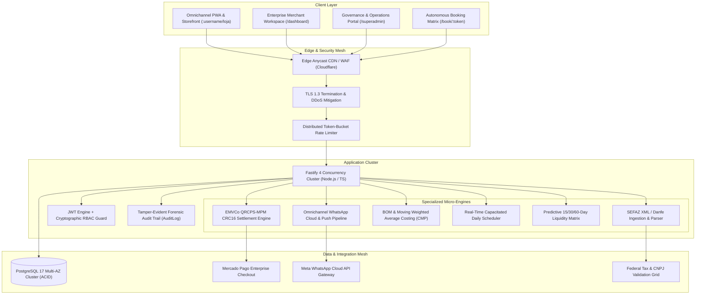

# BoraMarka & BoraEnkomenda — Enterprise Omnichannel Commerce & Micro-Manufacturing ERP

<p align="center">
  
  
  
  
  
  
</p>

---

## 📑 Executive Overview

**BoraMarka** and **BoraEnkomenda** represent a mission-critical, enterprise-grade B2B SaaS platform engineered to orchestrate and scale high-concurrency service scheduling, decentralized omnichannel retail, and on-demand micro-manufacturing workflows.

Built on an event-driven, micro-modular architecture with sub-second transaction finality, the ecosystem eliminates friction in retail operations by unifying direct central-bank PIX settlement, automated fiscal compliance (SEFAZ NF-e/NFC-e), finite capacity production planning (MES/BOM/CMP), and predictive financial treasury management.

---

## 🏛️ Platform Architecture & Topology

The platform operates on a decoupled, zero-trust infrastructure designed for linear scalability, high throughput, and high fault tolerance.



---

## ⚡ Core Business Verticals & Enterprise Engines

### 1. 📅 BoraMarka OS — Autonomous Service Execution
Designed for clinics, premium barber shops, high-volume beauty studios, and multi-staff appointment centers:
- **Autonomous Reservation Matrix**: Real-time slot conflict prevention with bi-directional Google Workspace Calendar synchronization.
- **Zero No-Show Escrow Protocol**: Automated generation of central-bank EMVCo CRC16 dynamic PIX payment requests for deposit securing prior to calendar lock.
- **Multi-Resource Staff Ledger**: Automated commission splits, shift management, and individual professional performance attribution.
- **Conversational Notification Pipeline**: Automated transaction status and reminder dispatches via official WhatsApp Cloud API.

### 2. 🧁 BoraEnkomenda OS — On-Demand Manufacturing & Commerce ERP
Tailored for confectionery ateliers, food production lines, artisanal manufacturing, and custom goods creators:
- **Manufacturing Execution System (MES) Kanban**: State-machine workflow (*Novo*, *Confirmado*, *Em Produção*, *Pronto*, *Entregue*) with strict financial checks before production commitment.
- **Bill of Materials (BOM) & Recipe Formulation**: Dynamic ingredient mapping per SKU, automated gross margin calculation, and real-time inventory depletion.
- **Moving Weighted Average Costing (CMP)**: Continuous financial recalculation of stock asset valuation upon each fiscal invoice ingestion.
- **Capacitated Production Limiter**: Daily maximum order throttling with calendar override protection to prevent assembly line overload.
- **Direct Thermal Slip Printing**: Native kitchen and prep-bench comanda formatting with itemized customization specs and delivery logistics.
- **Smart Procurement Matrix**: Automated multi-order ingredient aggregation for batched wholesale replenishment.
- **Omnichannel CRM & LTV Intelligence**: Recency, Frequency, Monetary (RFM) cohort segmentation, customer ranking, and zero-login order tracking.

### 3. 📊 Predictive Treasury & Financial Governance
- **Real-Time Cash Flow Projections**: Algorithmic liquidity forecast (15, 30, and 60 days forward) aggregating pending receivables, verified customer deposits, and scheduled supplier payables.
- **Fiscal XML Parser (NF-e / NFC-e)**: Resilient ingestion of 44-digit SEFAZ XML documents with automated catalog matching and stock replenishment.
- **CNPJ Real-Time Telemetry**: Instant federal tax authority entity validation via automated gateway integration.

---

## 🛡️ Enterprise Security, Governance & Compliance

| Domain | Standard / Implementation | Architectural Guarantee |
| :--- | :--- | :--- |
| **Data Protection** | **LGPD (Lei nº 13.709/2018)** | Strict tenant isolation, data subject access protocols, and granular retention controls. |
| **Authentication** | **Cryptographic JWT + RBAC** | Multi-tier segregation between Tenant Operators, Store Administrators, and Platform SuperAdmins. |
| **Integrity & Forensics** | **Immutable Audit Trail** | Microsecond-accurate recording of all high-impact actions (deletions, edits, status transitions, financial adjustments). |
| **Application Hardening** | **OWASP Top 10** | Strict input sanitization via Zod schemas, parameterized SQL via Prisma ORM, Helmet security headers, and IP rate limiting. |
| **Settlement Protocol** | **BACEN EMVCo QRCPS-MPM** | Autonomous calculation of polynomial CRC16 (`0x1021`) payloads with zero intermediary retention. |
| **Password Security** | **Argon2id / Salted Bcrypt** | Work-factor calibrated hashing algorithms resistant to GPU-accelerated dictionary attacks. |

---

## 🛠️ Technology Stack & Engineering Standards

```
Application Layer:
├── Runtime:            Node.js LTS (v20.x+)
├── HTTP Framework:     Fastify v4.28 (Low-overhead, JSON Schema optimized)
├── Primary Language:   TypeScript v5.5 (Strict mode enabled, zero-any policy)
├── Client Interface:   React v18.3, Vite v5.4, TailwindCSS v3.4 (Design System)
├── State Management:   React Hooks, Context Architecture, Optimistic UI Mutators
├── Data Modeling:      Prisma ORM v5.18
└── Database Engine:    PostgreSQL 17 Enterprise Multi-AZ
```

---

## 📂 Repository Topology

```
BoraMarka/
├── backend/
│   ├── prisma/
│   │   └── schema.prisma        # Enterprise Data Domain & Relation Mapping
│   ├── src/
│   │   ├── plugins/             # Auth, Rate-Limit, Helmet, Cors, Compression
│   │   ├── routes/              # High-concurrency route handlers (Admin, ERP, Orders, etc.)
│   │   ├── services/            # Fiscal parser, PIX engine, WhatsApp, BOM, Cash Flow
│   │   ├── utils/               # Cryptographic primitives, date arithmetic, Zod schemas
│   │   └── server.ts            # Fastify application entrypoint & lifecycle hooks
│   └── tests/                   # Automated Vitest regression & verification suites
│
├── frontend/
│   ├── src/
│   │   ├── components/          # Reusable enterprise design system components
│   │   │   ├── common/          # In-app ConfirmModal, Toasts, Badges
│   │   │   ├── charts/          # Canvas-accelerated analytics (Donut, Bar, Timeline)
│   │   │   └── dashboard/       # Specialized workspaces (Kanban, Calendar, Catalog, ERP)
│   │   ├── pages/               # Enterprise dashboard, storefront, booking portal
│   │   └── services/            # Typed Axios HTTP gateway with interceptor pipeline
│   └── index.html               # PWA shell with hardware-accelerated viewport
```

---

## 🚀 Quality Assurance & Verification

The codebase is backed by a continuous integration pipeline verifying static type safety and automated unit regression suites across all financial and calculation routines:

```bash
# Automated verification test suite (Vitest)
npm test

# Static type verification across all workspaces
npx tsc --noEmit
```

---

## 📄 Intellectual Property & Enterprise Licensing

Copyright © 2026 **BoraMarka Tecnologias Digitais S/A**. All Rights Reserved.

This software, its source code, architecture, and associated documentation are proprietary and confidential property of BoraMarka Tecnologias Digitais S/A. Unauthorized copying, decompilation, distribution, or commercial exploitation is strictly prohibited under international copyright and intellectual property laws.
