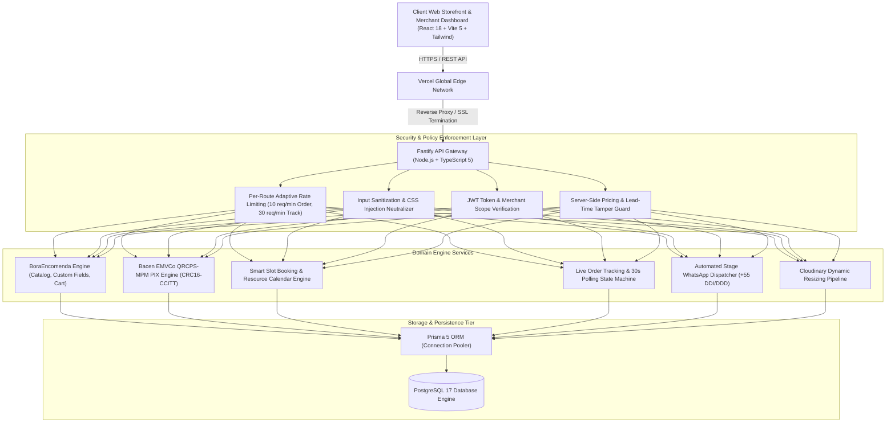

# BoraMarka — Enterprise Multi-Tenant SaaS Platform

<p align="center">
  
  
  
  
  
  
  
</p>

---

## 1. Production Topology & Cloud Infrastructure

| Subsystem | Production Endpoint | Cloud Provider / Topology | SLA Target |
| :--- | :--- | :--- | :---: |
| **Web Frontend** | [https://boramarka.com.br](https://boramarka.com.br) | Vercel Edge Global Anycast CDN | 99.99% |
| **Core API Gateway** | [https://api.boramarka.com.br](https://api.boramarka.com.br) | Railway Isolated Linux Node Container | 99.95% |
| **Relational Database** | Managed PostgreSQL 17 Cluster | Railway High-Availability Dedicated Tier | 99.99% |
| **Asset Pipeline** | `res.cloudinary.com/boramarka` | Cloudinary Multi-Region WebP/AVIF CDN | 99.99% |
| **Transactional Mail** | `noreply@boramarka.com.br` | Resend API (DKIM / SPF / DMARC Verified) | 99.90% |
| **Version Control** | [`thevigillant/boramarka`](https://github.com/thevigillant/boramarka) | GitHub Enterprise CI/CD Pipeline | Active |

---

## 2. System Architecture



---

## 3. Core Modules & Engine Specifications

### 3.1. BoraEncomenda Engine (v3.0)
- **Cinematic Storefront Interface (`/:username/loja`)**:
  - Dark Luxury design system with ambient mesh lighting and frosted glassmorphic containers.
  - Automated 6-second rotating widescreen featured showcase (21:9 aspect ratio) with linear progress indicators.
  - Real-time availability simulator (Scheduling HUD) verifying lead time (`minAdvanceDays`) dynamically before checkout.
  - Recent Arrivals section highlighting products listed within the last 14 days.
  - Client-side persistent Wishlist storing saved items via browser storage with dedicated filter chips.
  - Integrated Bespoke VIP Concierge card directing custom orders directly to WhatsApp.
- **Bacen EMVCo Standard PIX Payload Engine**:
  - Implements official EMVCo QRCPS-MPM standard payload generation with CRC16-CCITT checksum calculation.
  - Auto-fills exact deposit amount (`depositAmount` or 100% full payment) and merchant identity in consumer banking applications (Nubank, Itaú, Bradesco, Inter).
  - No merchant developer credentials required; operates seamlessly with standard PIX keys.
- **Zero-Friction WhatsApp Notification Pipeline**:
  - Automatic dispatch of structured message templates across Kanban lifecycle transitions (`CONFIRMADO`, `EM_PRODUCAO`, `PRONTO`, `ENTREGUE`).
  - Separation between merchant contact WhatsApp numbers and banking PIX keys.
  - Brazilian phone normalization (+55 with DDD sanitization).
- **Live Real-Time Order Tracking (`/pedido/:orderNumber/rastrear`)**:
  - Dynamic status timeline with stage completion bars.
  - 30-second background polling cycle updating order state without full page refreshes.
  - PII masking enforcing LGPD compliance for public URL sharing.

### 3.2. Automated Service Scheduling Engine
- **Calendar & Slot Computing**:
  - Concurrent resource calculation incorporating lunch breaks, individual buffer times, and operating windows.
  - Multi-service cart checkout allowing combined procedures in single booking slots.
- **Client Rating & Feedback Lifecycle**:
  - Post-appointment customer satisfaction tracking with automated review aggregation.

---

## 4. Security Architecture & Threat Mitigation

| Threat Vector | Mitigation Strategy | Implementation Detail |
| :--- | :--- | :--- |
| **CSS / DOM Injection** | Regular expression color sanitizer | Rejects malicious style strings; enforces strict `#RGB`, `#RRGGBB`, and bounded functional color expressions. |
| **Cart Price Tampering** | Server-side pricing recalculation | Ignores client-provided subtotals; queries database product records inside transactional boundary. |
| **Lead-Time Violation** | Server-side calendar delta check | Verifies `deliveryDate - today >= minAdvanceDays` before persisting order entity. |
| **Credential Leakage** | API response payload filtering | Completely removes sensitive API tokens (`mpAccessToken`) and PIX keys from public storefront GET payloads. |
| **PII Scraping / Enumeration** | Deterministic token authorization & PII masking | Masks customer names, phones, emails, and street addresses unless accessed with 16-character cancellation/security token. |
| **DoS / Brute Force** | Per-route tiered rate limiting | 10 requests/minute on order creation (`POST /api/store/:username/order`); 30 requests/minute on tracking lookup. |

---

## 5. Technology Stack

### Frontend Application
- **Runtime & Tooling**: Node.js 20+, React 18, Vite 5, TypeScript 5
- **Styling & Design System**: Tailwind CSS v3, Custom Keyframe Animations, Glassmorphism
- **Iconography**: Lucide Icons
- **QR Code Generation**: `qrcode` DataURL Generator, Custom EMVCo Generator

### Backend API
- **Framework**: Fastify v4 (High-Throughput Node.js REST API)
- **ORM & Data Layer**: Prisma 5, PostgreSQL 17
- **Security & Middleware**: `@fastify/rate-limit`, `@fastify/helmet`, `@fastify/jwt`, `bcryptjs`
- **Validation**: Zod Runtime Schema Validation

---

## 6. Local Development & Installation

### Prerequisites
- Node.js >= 18.0.0
- PostgreSQL >= 15.0
- npm >= 9.0.0

### Setup Repository

```bash
# Clone the repository
git clone https://github.com/thevigillant/boramarka.git
cd boramarka

# Install Backend Dependencies
cd backend
npm install

# Setup Environment Variables
cp .env.example .env

# Run Database Migrations
npx prisma migrate dev

# Install Frontend Dependencies
cd ../frontend
npm install
```

### Starting Development Servers

```bash
# Terminal 1 - Backend (Port 3333)
cd backend
npm run dev

# Terminal 2 - Frontend (Port 5173)
cd frontend
npm run dev
```

---

## 7. Production Build & Deployment

```bash
# Build Frontend Bundle
cd frontend
npm run build

# Build Backend Distribution
cd ../backend
npm run build
```

---

## 8. License & Intellectual Property

Proprietary Software. All rights reserved. BoraMarka Platform — 2026.
