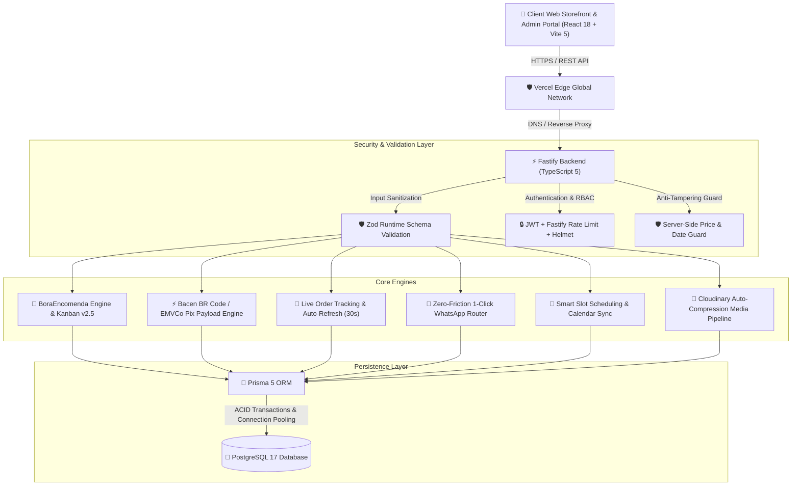

# 🚀 BoraMarka — Enterprise SaaS Platform for Automated Scheduling & Custom Product Orders

<p align="center">
  
  
  
  
  
  
  
  
</p>

---

## 🌐 Official Production Infrastructure

| Component | Endpoint | Provider / Architecture | SLA & Status |
| :--- | :--- | :--- | :---: |
| 🌐 **Web Application** | [https://boramarka.com.br](https://boramarka.com.br) | Vercel Edge Global Anycast CDN | 99.99% |
| ⚡ **API Server (REST Backend)** | [https://api.boramarka.com.br](https://api.boramarka.com.br) | Railway Isolated Linux Container | 99.95% |
| 📸 **Media Storage Pipeline** | `res.cloudinary.com/boramarka` | Cloudinary High-Res CDN | 99.99% |
| 📧 **Transactional Mailer** | `noreply@boramarka.com.br` | Resend API (DKIM / SPF Verified) | 99.90% |
| 📦 **Codebase Repository** | [`thevigillant/boramarka`](https://github.com/thevigillant/boramarka) | GitHub Enterprise CI/CD | Active |

---

## 💡 System Architecture Overview

**BoraMarka** is a multi-tenant SaaS engineered both for **service establishments** (barbershops, beauty salons, health clinics, tattoo studios, pet centers) and **custom-order makers & confectioneries** (cakes, pastries, gourmet gift boxes, buffets, artisanal crafts).



---

## 💎 Core Capabilities & Engineering Highlights

### 🎂 BoraEncomenda Engine (v2.5)
- **High-Converting Digital Storefront (`/:username/loja`)**: Modern responsive catalog with category filters, dynamic customization questions, high-res photos, and smart cart.
- **⚡ Official Bacen BR Code / PIX Copia e Cola with Automatic Amount**:
  - Implements standard EMVCo QRCPS-MPM with CRC16-CCITT checksum.
  - Generates instant high-res QR Codes in SVG/Canvas.
  - When the client copies and pastes the code into their banking app (Nubank, Itaú, Inter, Bradesco), **the exact deposit amount and store name are automatically filled**.
  - **Zero technical barrier**: The merchant simply inputs their standard PIX key (CPF, phone, email, or random key). No merchant developer accounts or API keys required.
- **💬 Zero-Friction WhatsApp Notification Workflow**:
  - Automated pre-formatted message dispatch upon Kanban stage transitions (`CONFIRMADO`, `EM_PRODUCAO`, `PRONTO`, `ENTREGUE`).
  - Strict segregation between merchant's WhatsApp customer service phone and bank PIX key.
  - Smart Brazilian DDI/DDD normalization (+55).
- **📡 Live Order Tracking Page (`/pedido/:orderNumber/rastrear`)**:
  - Dynamic status-themed gradient heroes.
  - Real-time animated vertical timeline with stage progress bars.
  - **30-second background auto-refresh countdown**: updates status automatically without page reload.
  - Pulsing *"Ao Vivo"* live badges when production starts.
  - Integrated one-click WhatsApp help button.
- **🛡️ Anti-Fraud & Scam Protection Guard**:
  - Server-side date validation against past dates or violated lead times (`minAdvanceDays`).
  - Server-side price recalculation directly from the database (anti-tampering).
  - Explicit UI alert on Kanban preventing production startup without verified bank balance (protects against scheduled/fake PIX scams).
  - LGPD-compliant PII masking for public tracking endpoints.

### 📅 Smart Appointment Booking Engine
- **Service Showcase**: Visual merchandising with duration badges, multi-photo carousels, and upsell combo add-ons.
- **Automated Slot Computation**: Real-time calendar availability calculation taking into account break times, operating hours, and concurrent staff limits.
- **Social Proof & Verified Reviews**: Star ratings, client testimonials, and automated review moderation.

---

## 🏗️ Technology Stack

| Layer | Technology | Key Specifications |
| :--- | :--- | :--- |
| **Frontend UI** | React 18, Vite 5, Tailwind CSS | SPA architecture, Lucide Icons, Glassmorphism, Theme Engine |
| **QR & Pix Engine** | `qrcode`, Custom Bacen EMVCo Generator | CRC16 CCITT, SVG/Canvas DataURL rendering |
| **Backend API** | Fastify v4, TypeScript 5, Node.js | Low-overhead routing, Schema serialization, JWT, Rate Limiter, Helmet |
| **Validation** | Zod v3 | Runtime payload validation, Type inference, Sanitization |
| **Database & ORM** | PostgreSQL 17, Prisma 5 | High-concurrency ACID transactions, Schema migrations, Connection pooling |
| **Unit Testing** | Vitest | 100% test pass rate across critical validators and PIX generators |
| **Media Pipeline** | Cloudinary REST API | High-res image storage, auto-scaling and format optimization |
| **Email Infrastructure** | Resend API HTTP | Transactional DKIM/SPF authenticated email delivery (`boramarka.com.br`) |
| **Deployment & CI/CD** | Vercel (FE) + Railway (BE) | Global CDN edge network and containerized microservice deployments |

---

## 🔌 REST API Directory

```
/api
├── /storefront
│   ├── GET    /:username               # Public store profile, products & order settings
│   ├── POST   /:username/order         # Place public custom order with Bacen Pix deposit
│   └── GET    /tracking/:trackingCode  # Public real-time order status tracking with LGPD masking
├── /products                           # Custom-order product catalog & categories
│   ├── GET    /                        # List store products & customization questions
│   ├── POST   /                        # Create product with lead time, photos & options
│   ├── PUT    /:id                     # Update product details
│   └── DELETE /:id                     # Remove product
├── /orders                             # BoraEncomenda production management
│   ├── GET    /                        # Store orders with status filters
│   ├── GET    /stats                   # Order KPIs, revenue & pending counts
│   └── PATCH  /:id/status              # Kanban stage transition (NOVO -> ENTREGUE)
├── /upload                             # Cloudinary high-res image pipeline
├── /auth                               # Multi-tenant admin & operator authentication
├── /services                           # Services & upsell combos
├── /schedule                           # Time-slot appointment bookings
├── /reviews                            # Verified social proof reviews
├── /finance                            # Cash flow ledger & transaction metrics
└── /support                            # Helpdesk tickets & CSAT engine
```

---

## 🛠️ Local Development & Testing

### 1. Backend Service
```bash
cd backend
npm install
npx prisma generate
npm test               # Runs Vitest test suite (22 unit tests)
npm run dev            # Starts Fastify on http://localhost:3001
```

### 2. Frontend Application
```bash
cd frontend
npm install
npm test               # Runs Vitest test suite (10 unit tests)
npm run build          # Validates TypeScript compilation & Vite bundle
npm run dev            # Starts Vite on http://localhost:5173
```

---

## 📄 License & Proprietary Notice

Copyright © 2026 BoraMarka S.A. All rights reserved.
Developed with Big Tech engineering standards for high reliability and exceptional user experience.
